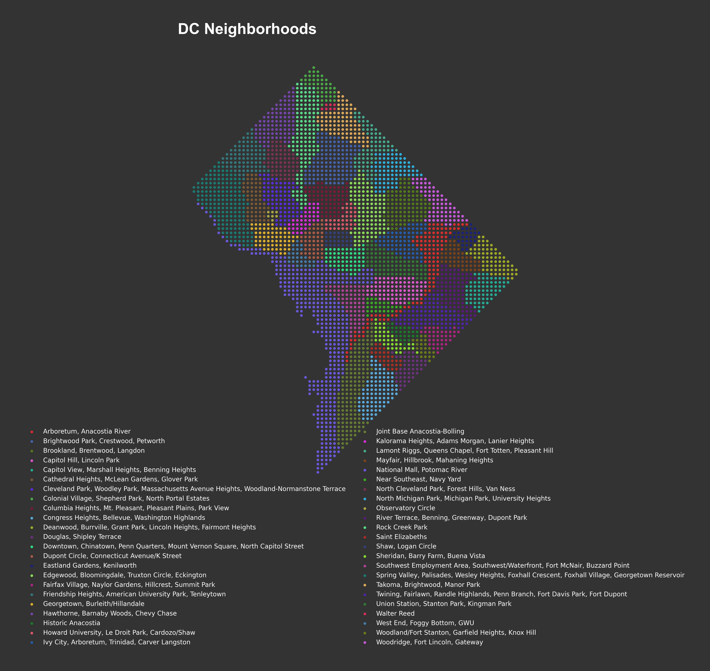

# DotMap Geographic Data Visualization Tool

This module provides functionality for creating stylized point-based visualizations
of geographic data using shapefiles. It's particularly useful for creating
distinctive visualizations of neighborhood or regional data.

This is essentially a port of Iva Brunec's R code to Python, with some modifications

https://bsky.app/profile/ivabrunec.bsky.social

https://bsky.app/profile/ivabrunec.bsky.social/post/3lbq4qcyils2i

https://github.com/ivabrunec/30daymapchallenge/tree/main/2024/day_24_circles

With additional inspiration from the following sources:

https://bsky.app/profile/karaman.is

# DC Neighborhoods

